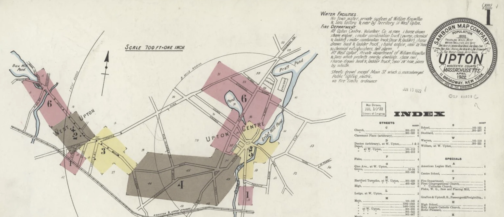
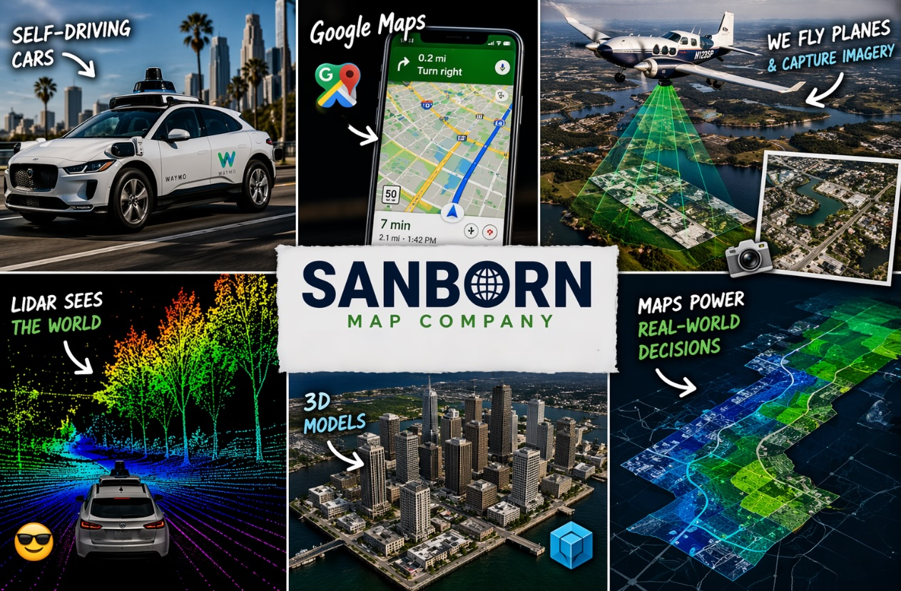

Hi! I'm _Mark_

a Software Engineering Manager

at the **Sanborn Map Company**

* * *

before we start...

why am I _here?_

because someone once showed _me_

that **STEM** was a _real path_

and I want to do the _same_ for you

my hope today:

you leave with **one idea**

that engineering is _bigger_ and _weirder_ than you think

and maybe... _for you_

* * *

so first — _what do I do?_

(super old map making company)

we make _digital_ maps for all sorts of uses.

 like...

I lead a team of _8 engineers_

we code in _Javascript_, _Python_, _Ruby_, and more

* * *

ok but what does an _engineering manager_ actually do all day?

let me walk you through a _week_

**every morning**: _standup_

15 minutes, whole team

what did you do yesterday? what are you doing today? what's _blocking_ you?

**Monday**: 1-on-1s

30 minutes with each engineer

how's life? how's the code? what do you need from me?

**Tuesday**: I code

right now — a _mobile app_ for field crews

**Wednesday**: more code

a web app for tracking _broadband internet_ rollout

**Thursday**: build a _prototype_

can we detect _highway work zones_ from **traffic camera** feeds?

(spoiler: _yes_, with a little AI)

**Friday**: dev lunch

then I read my team's code and tell them what's _great_ and what could be _better_

How many programmers does it take to change a light bulb?

None. That's a _hardware problem_

* * *

now — _how did I end up here?_

I went to **Brandeis University**

studied _International and Global Studies_

(yeah, not computer science)

but while I was there, I fixed **all the computers**

took _one_ CS class

I almost _failed_ it

and I rowed. a _lot._

but I loved _building things_

so I taught myself **PHP** and **HTML**

did a senior project on _Combating Cyber-Terrorism_

then I became a _web developer_ 🧙

* * *

but what I _really_ wanted to do...

was **coach rowing**

so I did. for _12 years._

finished as a coach on the **US National Team**

training athletes for the _Olympics_

rowing is _physics_ + _teamwork_ + _failing over and over_

sound familiar?

a boat goes faster when **8 people** pull at the **exact same time**

an engineering team ships faster when _8 people_ pull together too

and the whole time I was coaching...

I kept _building software_

apps to keep my team _organized_

tools to measure how _fast_ our boats were going

I didn't know it yet, but I was already _an engineer_

* * *

so what's the _takeaway?_

1. follow your _passions_
2. engineering is _everywhere_
3. be **curious**
4. break things (then _fix_ them)
5. ask _why?_ (and _why not?_) a lot
6. learn to work on a **team**
7. learn from _everyone_ around you

the secret skill of every engineer:

_talking to humans_

Why did the function go to therapy?

It had too many _unresolved arguments_

* * *

thanks for listening!

now go _build something_

_questions?_
